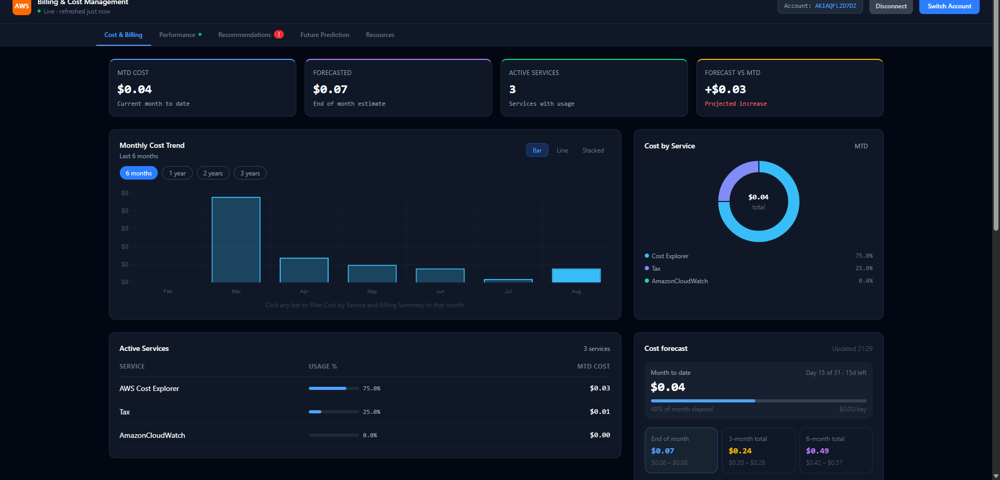
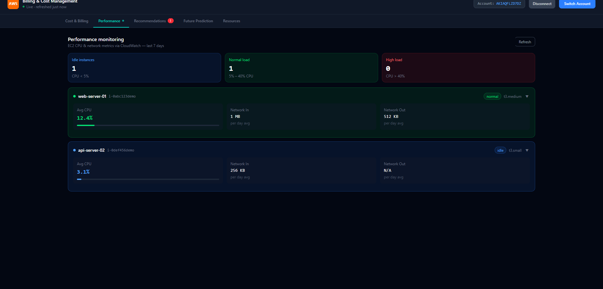
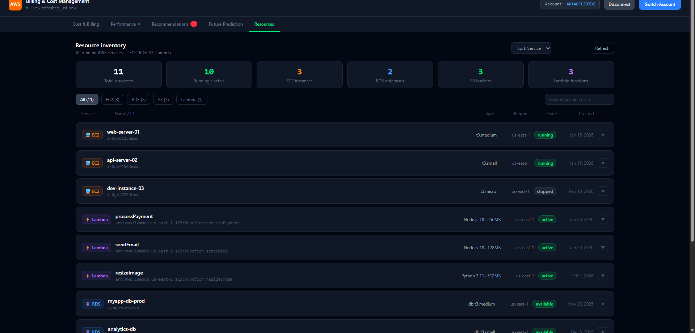
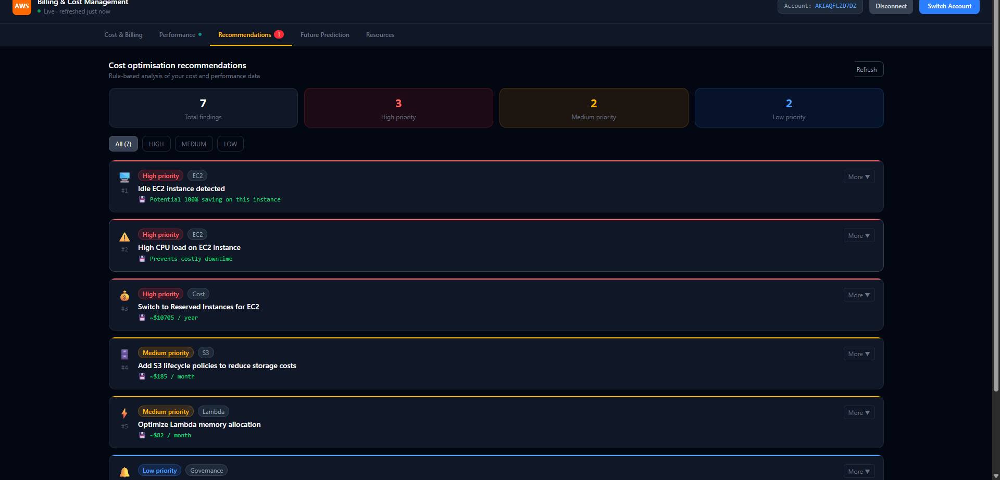
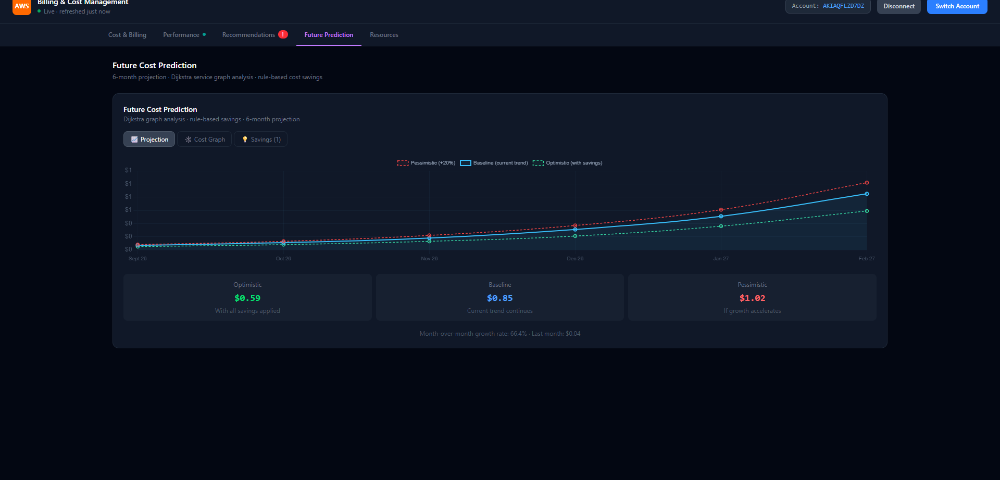

# AWS Billing Dashboard

A full-stack cost management and monitoring dashboard for AWS accounts — visualize billing trends, forecast upcoming spend, review EC2/RDS/S3/Lambda inventory, monitor EC2 performance via CloudWatch, and get rule-based cost-saving recommendations.

## Live Demo

**[aws-billing-dashboard.vercel.app](https://aws-billing-dashboard.vercel.app/)**

Frontend hosted on Vercel. Backend hosted on Render.

Opens directly in **Demo mode** — no AWS account or setup needed to explore it.

## Overview

AWS's own Billing Console is dense and spread across several separate pages. This project pulls the numbers a developer actually checks day-to-day — current spend, forecast, per-service breakdown, resource inventory, and basic performance/cost-optimization signals — into a single dashboard, backed directly by the real AWS SDK rather than a static export.

It's built as a genuine two-part app: a React frontend and an Express backend that does the actual AWS SDK calls, so credentials never need to touch a third-party service.

## Problem Statement

Checking AWS spend day-to-day means navigating Cost Explorer, CloudWatch, and several service consoles separately, each with their own UI and level of detail. This project consolidates the parts of that workflow most relevant to a single developer or small project — spend, forecast, resource inventory, basic performance, and simple cost-saving signals — into one page.

## Key Features

- **Cost & Billing** — monthly/daily spend trends, service-by-service breakdown, month-over-month comparison, all-time summary
- **Forecast** — 3-window (end-of-month / 3-month / 6-month) cost forecast via AWS Cost Explorer, with confidence range
- **Resources** — inventory of EC2, RDS, S3, and Lambda resources with search, filter, and sort
- **Performance** — EC2 CPU and network utilization (last 7 days) via CloudWatch, per-instance drill-down
- **Recommendations** — rule-based engine surfacing idle instances, oversized resources, and other cost-saving opportunities
- **Future Cost Prediction** — 6-month linear cost projection, plus a service-dependency graph using **Dijkstra's algorithm** to explore cost-optimal paths between your highest-spend services
- **Demo mode / Live mode** — every data-driven tab works with realistic mock data out of the box, and switches to real AWS data once you connect an account

## Architecture

```
User
  ↓
React + Vite Frontend  (Vercel)
  ↓  (AWS credentials sent as request headers, only when Live mode is active)
Express Backend        (Render)
  ↓
AWS SDK v3
  ↓
AWS Services  (Cost Explorer, CloudWatch, EC2, RDS, S3, Lambda)
```

The frontend never talks to AWS directly. Every AWS call happens server-side: the backend builds a fresh AWS SDK client per request, either from the credentials the user connected through the UI (Live mode) or from static mock data (Demo mode). There is no database and no authentication layer — this is a live-query tool against a single AWS account per session, not a persisted, multi-user system.

## AWS Services

Verified directly against the AWS SDK clients used in `server/services/`:

- **AWS Cost Explorer** — cost/usage data, forecasting
- **Amazon CloudWatch** — EC2 CPU and network metrics
- **Amazon EC2** — instance inventory and performance
- **Amazon RDS** — database instance inventory
- **Amazon S3** — bucket inventory
- **AWS Lambda** — function inventory

All access is read-only (see [AWS IAM Permissions](#aws-iam-permissions)).

## Tech Stack

**Frontend:** React 18, Vite 7, Tailwind CSS 4, Chart.js / react-chartjs-2, axios
**Backend:** Node.js, Express 4, AWS SDK v3 (`@aws-sdk/client-cost-explorer`, `client-cloudwatch`, `client-ec2`, `client-rds`, `client-s3`, `client-lambda`)

No database. No user authentication — this is a single-operator tool; anyone with the running app and a valid AWS key can view that account's data.

## Demo Mode vs Live Mode

**Demo mode** — the default on every tab. Uses realistic static mock data generated client-side or served by the backend's `/demo` endpoints. No AWS credentials required at all.

**Live mode** — once you connect an AWS account (see below), each tab switches to pulling real data through the backend's AWS SDK integration. If you're already connected, Performance, Resources, and Recommendations default to Live automatically when you open them; you can still switch any individual tab back to Demo mode manually.

## Future Cost Prediction & Dijkstra

The 6-month linear cost projection and the service-dependency graph's **node costs** are both real — calculated directly from actual monthly billing data returned by Cost Explorer.

The graph's **edge weights** (the lines connecting services, representing an "interaction cost" between them) are illustrative/simulated. AWS doesn't expose a real per-service-pair interaction or data-transfer cost through any API this project uses, so those specific numbers are generated rather than measured. The app discloses this directly in the UI (an "Edges estimated" label) rather than presenting them as real.

This is a real, working implementation of Dijkstra's algorithm — not a placeholder — but it's important to be clear: it's a deterministic graph algorithm over partly-illustrative data, not a machine learning or AI model of any kind.

## Screenshots

**Cost & Billing**


**Performance**


**Resources**


**Recommendations**


**Future Cost Prediction**


## Getting Started

### Backend Setup

```bash
cd server
npm install
```

Create `server/.env`:

```
PORT=3001
AWS_ACCESS_KEY_ID=your_access_key       # optional — only used as a fallback
AWS_SECRET_ACCESS_KEY=your_secret_key   # if no account is connected via the UI
AWS_REGION=us-east-1
FRONTEND_URL=http://localhost:5173      # for CORS in non-local deployments
```

You generally **don't need** to set AWS credentials in `.env` — the app is designed to take credentials through the **Connect Account** button in the UI instead. The `.env` values are only used as a fallback if no account is connected through the UI.

```bash
npm run dev      # starts on http://localhost:3001 with auto-reload
```

### Frontend Setup

```bash
npm install
npm run dev       # starts on http://localhost:5173
```

Open `http://localhost:5173` — the dashboard loads in Demo mode immediately.

### Production Build

```bash
npm run build      # outputs to dist/
npm run preview    # preview the production build locally
```

## Environment Variables

| Variable | Used by | Required? |
|---|---|---|
| `PORT` | Backend | No — defaults to `3001` |
| `AWS_ACCESS_KEY_ID` | Backend | No — fallback only, prefer connecting via the UI |
| `AWS_SECRET_ACCESS_KEY` | Backend | No — fallback only, prefer connecting via the UI |
| `AWS_REGION` | Backend | No — defaults to `us-east-1` |
| `FRONTEND_URL` | Backend | No — only needed for CORS in non-local deployments |
| `VITE_API_URL` | Frontend | Yes, for production builds — points the frontend at the backend URL |

Never commit real credentials. `.env`, `server/.env`, and `.env.local` are all git-ignored.

## AWS IAM Permissions

Live mode needs a **read-only** IAM policy granting exactly:

```
ce:GetCostAndUsage
ce:GetCostForecast
ec2:DescribeInstances
rds:DescribeDBInstances
s3:ListBuckets
lambda:ListFunctions
cloudwatch:GetMetricStatistics
```

No write, create, or delete permissions are needed or used anywhere in this app. Do not use `AdministratorAccess` or another over-privileged key — scope a dedicated IAM user or role to exactly the list above.

## Usage

1. Open the app — it loads in Demo mode by default, no setup required.
2. Explore Cost & Billing, Performance, Resources, Recommendations, and Future Prediction with realistic sample data.
3. Click **Connect Account** and enter an AWS access key + secret key to switch to Live mode.
4. Once connected, Performance, Resources, and Recommendations default to Live automatically; any tab can still be switched back to Demo manually.
5. Click **Disconnect** to clear the connected credentials from the session.

## Project Structure

```
aws-billing-dashboard/
├── src/
│   ├── components/       # Dashboard, tabs, charts, cards
│   ├── hooks/             # useBillingData — data fetching + demo/live state
│   └── utils/              # formatCurrency, Chart.js setup
├── server/
│   ├── routes/            # billing, performance, recommendations, resources
│   ├── services/           # AWS SDK integration per domain
│   ├── utils/               # shared error-handling helpers
│   └── server.js             # Express app entry point
├── screenshots/           # README images
└── .env.production          # frontend build-time API URL (no secrets)
```

## API Overview

All endpoints are mounted under `/api`. Each domain has a `/demo` variant (no credentials needed, static mock data) and a `/live` or main variant (reads AWS credentials from `x-aws-access-key-id` / `x-aws-secret-access-key` / `x-aws-region` request headers, falling back to `server/.env` if none are sent).

| Route | Purpose |
|---|---|
| `GET /api/health` | Health check |
| `GET /api/billing/monthly`, `/daily`, `/forecast`, `/summary` | Cost Explorer data |
| `GET /api/performance/demo`, `/ec2` | CloudWatch EC2 metrics |
| `GET /api/resources/demo`, `/live` | EC2/RDS/S3/Lambda inventory |
| `GET /api/recommendations/demo`, `/live` | Rule-based cost recommendations |

## Security Considerations

- AWS credentials entered via **Connect Account** are kept only in browser memory for the session — not written to disk, not stored in `localStorage`, and cleared on disconnect or page refresh.
- Credentials are sent to the backend as request headers on each API call while Live mode is active; the backend uses them to build a fresh AWS SDK client per request rather than storing them.
- This is **not** enterprise-grade credential security. A long-term IAM access key pasted into a browser form is inherently more exposed than a short-lived/session-based credential. This is an accepted trade-off for a personal, single-operator tool — don't use a key with broader permissions than listed above, and don't deploy this publicly with a key you're not comfortable exposing.
- No secrets are committed to this repository; `.env` files are git-ignored.

## Limitations

These are current, intentional characteristics of the project — not open bugs:

- No database — nothing persists between sessions; each page load starts fresh (Demo mode) or requires reconnecting an account (Live mode)
- No user authentication or multi-tenancy — one AWS account per session
- The Future Cost Prediction graph's edge weights are illustrative/simulated (see [Future Cost Prediction & Dijkstra](#future-cost-prediction--dijkstra)) — clearly disclosed in the UI, not presented as measured data

## Future Improvements

Ideas for extending this project — none of the following are implemented today:

- Replace per-request credential headers with a short-lived, server-side session token
- Add lightweight authentication for multi-user access
- Persist historical billing data instead of relying solely on Cost Explorer's live window
- Expand the rule-based recommendation engine with additional cost-saving checks
- Support connecting and comparing multiple AWS accounts
- Add coverage for more AWS services (e.g. DynamoDB, CloudFront)

